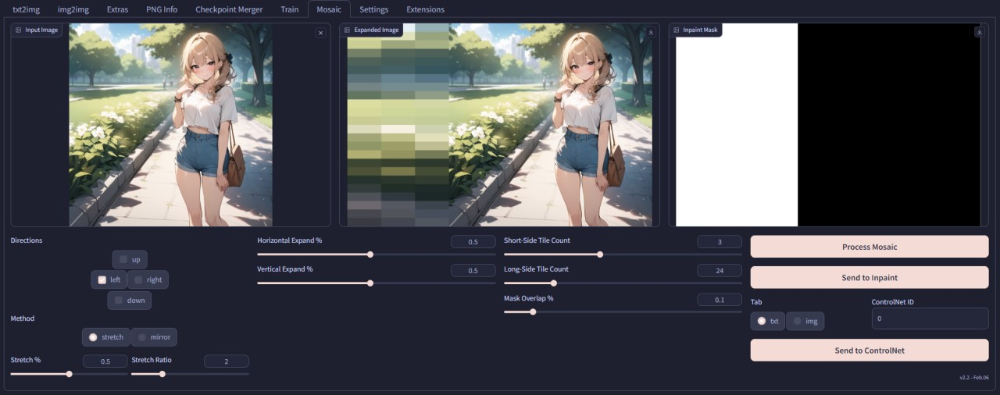
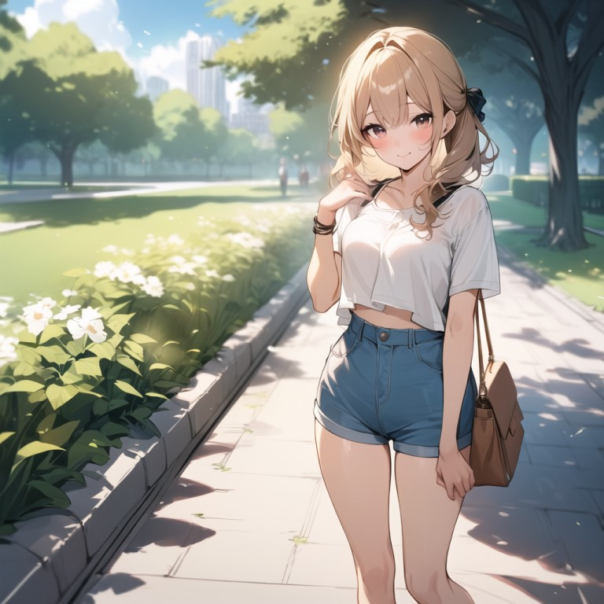
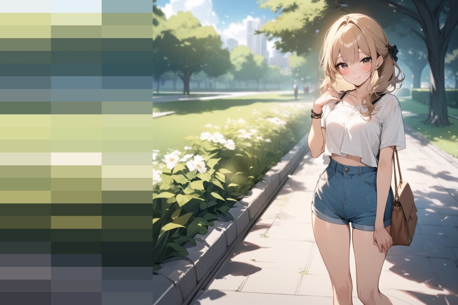
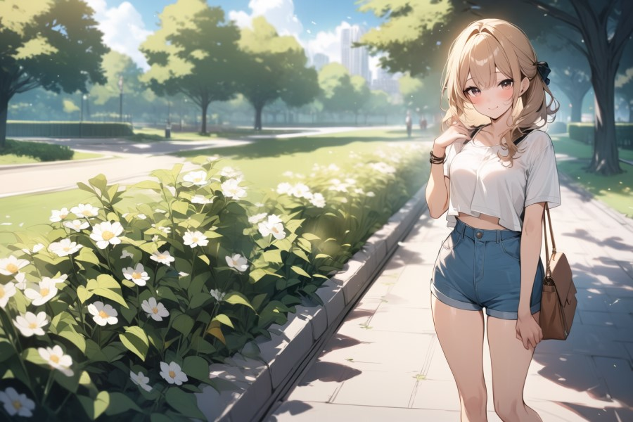

# SD Webui Mosaic Outpaint
This is an Extension for the [Automatic1111 Webui](https://github.com/AUTOMATIC1111/stable-diffusion-webui), which trivializes outpainting via a mosaic pattern,
without the need of ControlNet!

Inspired by this [Reddit Post](https://www.reddit.com/r/StableDiffusion/comments/1aexch9/using_mosaic_tiles_to_outpaint_expand_images_3/) by **u/wonderflex**

 
New <b>Mosaic</b> UI Tab

## How to Use
1. Inside the **Mosaic** tab, upload an image of choice
2. Choose the direction(s) to outpaint
3. Adjust the parameters *(explained below)* as needed
4. Press **Process Mosaic**
5. Once the images have been processed, press **Send to Inpaint**
6. In **img2img** tab, fill out the captions of the image
    - **eg.** The prompt used during **txt2img**
7. Set **Inpaint area** to `Whole picture` to keep the coherency; Increase **Mask blur** as needed
8. Set the **Denoising strength** to `0.9` ~ `1.0`
9. Set the resolution to **Resize by** `1.0`
10. Press **Generate** !

#### ControlNet
5. Alternatively: choose either **txt2img** or **img2img** tab, set the unit of ControlNet,
then press **Send to ControlNet**
6. Set **Control Type** to `Inpaint`
7. Set **Preprocessor** to `inpaint_only+lama`
8. Set **Control Mode** to `ControlNet is more important`
9. Set the resolution accordingly
10. Press **Generate** !

## Parameters
- **Directions:** The side of the image to expand
    - Selecting multiple sides is available
- **Method:** The method used to fill out the expanded space
    - **stretch:** Strecth the border of the image outwards *(used in the original post)*
        - **Stretch %:** The percentage of the expanded area used to stretch
        - **Stretch Ratio:** The scale of the stretching
    - **mirror:** Only mirror the image
- **Horitontal Expand %:** How much to expand in horitonzal direction
- **Vertical Expand %:** How much to expand in vertical direction
- **Short-Side Tile Count:** The number of horizontal tiles when expanding horitonzally *(vice versa for vertical)*
- **Long-Side Tile Count:** The number of vertical tiles when expanding horitonzally *(vice versa for vertical)*
- **Mask Overlap %:** The percentage of the original image to include in the Inpaint mask
    - Higher value reduces the seams, but also alters the original image

## Example
- **Checkpoint:** [Animagine XL V3](https://civitai.com/models/260267)

 
Input Image

 
Mosaic Pattern

 
Final Output

## Mosaic Inpaint
Now also comes with a **Script** for generating mosaic patterns within **Inpaint** masks.
*(Can also be used in **img2img** to convert the entire image into mosaic patterns before the generation.)*

> See this [thread](https://github.com/Haoming02/sd-webui-mosaic-outpaint/issues/2) for some examples

**Note:** If you have installed this extension before *(in the **Extensions** tab, it shows the **Branch** of this extension to be `main`)*, please uninstall and reinstall again *(so that it shows `master` instead)*!
